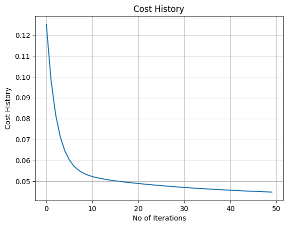
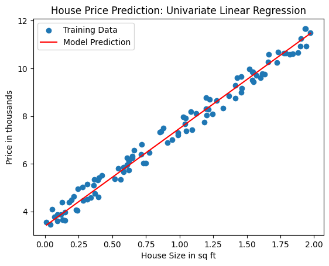

# House Price Prediction Using Univariate Linear Regression and Gradient Descent

## Overview

This project implements **univariate linear regression** from scratch to predict house prices based on house size. Built as part of my journey through Andrew Ng's Machine Learning Specialization (Week 1), this implementation uses only **NumPy** for numerical operations and **Matplotlib** for visualization — no machine learning libraries like scikit-learn are used.

The goal was to deeply understand:

- How linear regression works under the hood
- The mathematics of gradient descent
- How to implement ML algorithms without relying on pre-built libraries

## What This Project Does

- **Generates synthetic data** with a known linear relationship: `price = 4 + 3 × size + noise`
- **Implements the cost function** (Mean Squared Error) to measure prediction accuracy
- **Implements gradient descent** to find optimal parameters (θ₀, θ₁)
- **Tracks cost reduction** over iterations to verify convergence
- **Visualizes the results** with two key plots:
  - Cost vs. Iterations (shows learning progress)
  - Final regression line overlaid on training data (shows model fit)

## Why Univariate?

Starting with a single variable simplifies the learning process by:

- Making it easy to visualize the relationship between feature and target
- Allowing clear verification that gradient descent is working
- Building a strong foundation before moving to multivariate regression

## Model Details

### Hypothesis Function

```
h(x) = θ₀ + θ₁ · x
```

Where:

- `x` = house size (sq ft)
- `θ₀` = intercept (bias)
- `θ₁` = slope (weight for size)
- `h(x)` = predicted price

### Cost Function (Mean Squared Error)

```
J(θ₀, θ₁) = (1/2m) * Σ (h(x⁽ⁱ⁾) - y⁽ⁱ⁾)²
```

Measures how far predictions are from actual values.

### Gradient Descent Update Rules

```
θ₀ := θ₀ - α · (1/m) · Σ (h(x⁽ⁱ⁾) - y⁽ⁱ⁾)
θ₁ := θ₁ - α · (1/m) · Σ (h(x⁽ⁱ⁾) - y⁽ⁱ⁾) · x⁽ⁱ⁾
```

Where `α` (alpha) is the learning rate — the size of the step taken downhill.

## Results

### Final Parameters

After running gradient descent for 1000 iterations with `α = 0.1`:

- **θ₀ (intercept)**: ≈ 4.2 (true value: 4)
- **θ₁ (slope)**: ≈ 2.95 (true value: 3)

### Cost Reduction

- **Initial cost**: ~12.5
- **Final cost**: ~0.9 (irreducible error from noise)

### Key Observations

- Cost decreased rapidly in the first 200 iterations, then gradually flattened
- Final parameters closely match the true relationship despite added noise
- The model successfully captured the underlying linear pattern

## Visualizations

### 1. Cost vs. Iterations



_This plot shows gradient descent converging smoothly. The steep initial drop indicates fast learning, while the gradual flattening shows the algorithm approaching the minimum without oscillations._

### 2. Model Fit: Regression Line vs. Training Data



_Blue dots represent actual training data (house size vs. price). The red line shows model predictions using learned parameters. The line runs through the "middle" of the data points, confirming good fit._

## Technologies Used

- **Python 3** — Core programming language
- **NumPy** — Numerical operations and array handling
- **Matplotlib** — Data visualization and plotting
- **Jupyter Notebook / Google Colab** — Interactive development environment

## How to Run

### Prerequisites

Install required libraries:

```bash
pip install numpy matplotlib
```

### Steps

1. Clone this repository:

```bash
git clone https://github.com/FeralSatyam/House_Price_Prediction_Using_Univariate_Linear_Regression_and_Gradient_Descent.git
cd House_Price_Prediction_Using_Univariate_Linear_Regression_and_Gradient_Descent
```

2. Open the Jupyter notebook:

```bash
jupyter notebook house_price_gradient_descent.ipynb
```

3. Run all cells to:
   - Generate synthetic data
   - Implement and run gradient descent
   - View cost convergence plot
   - See the final regression line

## What I Learned

This project reinforced fundamental ML concepts:

1. **Gradient descent is an iterative optimization algorithm** — not magic! It takes small steps downhill based on computed gradients.

2. **Learning rate matters** — too small means slow convergence; too large causes divergence or oscillation.

3. **The derivative of the cost function yields simple averages** because of the chain rule and the structure of squared error.

4. **Noise creates irreducible error** — even a perfect model cannot achieve zero cost when data has random noise.

5. **Visualization is essential for debugging** — plotting cost history immediately reveals whether gradient descent is working.

## Next Steps

This project is the foundation for more advanced work:

- ✅ **Completed**: Univariate linear regression with loops
- ⬜ **Next**: Vectorized implementation using NumPy (faster, scalable)
- ⬜ **Next**: Multivariate linear regression (multiple features)
- ⬜ **Next**: Feature scaling and normalization
- ⬜ **Next**: Real-world dataset (Kaggle house prices)

## Acknowledgments

- **Andrew Ng** — Machine Learning Specialization (Coursera) for providing the conceptual foundation
- The open-source community for excellent tools like NumPy and Matplotlib

---

